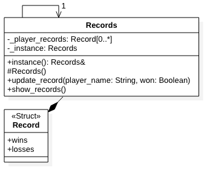

# Singleton

The singleton pattern enables us to create an object instance with global access but is limited to exactly one instance. A practical use of the singleton pattern is to create a master record of all the players in a game. Since a game might involve many people playing the game multiple times -- and perhaps at the same time as each other -- it is important to share the same representation of the records. Here is a UML illustration of a Singleton `Records` class:



## C++ example

In this case, we can create the `Records` class ([Records.cpp](Records.cpp) and [Records.h](Records.h)), which includes a private member variable called `_instance` that is a reference to a single instance of the object. That single instance is always returned by the public `instance` function. To prevent more instances from being created, the constructor is protected.

Note that in this implementation, the `instance()` function actually [declares the static reference to the Records instance](Records.cpp#L11). By declaring the single instance within this function, we achieve *lazy initialization* that only creates the instance upon its first request. A singleton can alternatively declare `_instance` as a member variable, as demonstrated in the *Gang of Four*'s original *Design Patterns* book.

### Running the example

The provided [main.cpp](main.cpp) file creates multiple `Records` variables, but as you run it, you will notice that all of them refer to the same singleton:

```{bash}
$ make
g++ -std=c++11 -Wfatal-errors *.cpp -o play
$ ./play
FIRST records
Player A: 0-1
SECOND records
Player A: 0-1
Player B: 2-0
THIRD records
Player A: 1-1
Player B: 2-0
```