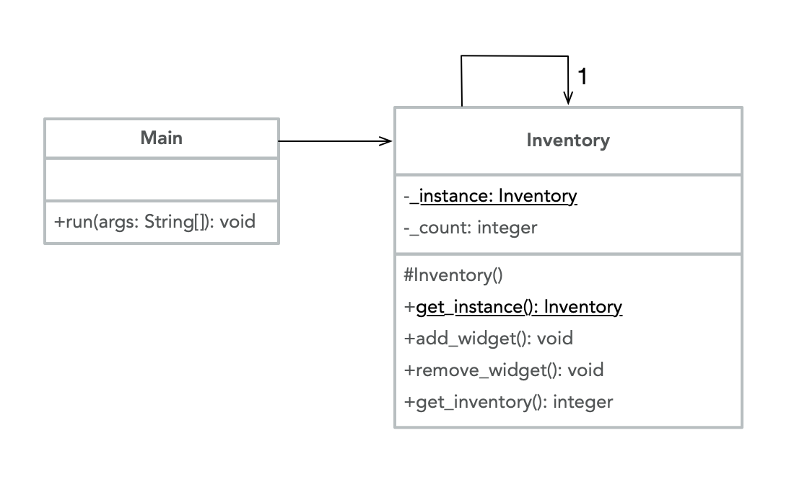

# Singleton

The Singleton is a creational design pattern that is used when a class with exactly one instance of itself is needed. The class keeps track of its own instance and makes sure that no other instances are created. This is accomplished with a global access point -- the constructor is protected or private, and clients can only access the class through a member function. The Singleton pattern is relatively straightforward and easy to use; however, it can lead to less modular code, and should only be used in cases where a single instance of a class is actually required.

A practical use of the Singleton pattern could be for an inventory, since all transactions need to be from the same single shared instance of the inventory. The inventory in this example tracks the production and sale of widgets; at any given moment in time, the number of widgets in inventory is the number that is actually available. Here is a UML illustration of a Singleton `Inventory` class:



## Java Example

In this case, we create the `Inventory` class [Inventory.java](Inventory.java), and have it include a private static member variable called `\_instance` that represents the single instance of the object. The single instance is always returned by the public `get\_instance` function. The `main` method can call all of the `Inventory` class methods, but it cannot create a new instance of the object.

While there are multiple ways to implement the Singleton pattern in Java, this example uses a protected constructor, a static member variable containing the only instance of the inventory, and a static member function to obtain the instance. This is how the Singleton pattern is represented in the *Gang of Four*'s original *Design Patterns* book. An alternative approach could be to use an enumeration to implement the inventory, since an enum is public, static, and final by default.

### Running the Example

To run this example, first compile the source file with `javac Inventory.java`; this creates executable byte code in a file called `Inventory.class`. Then run the program with `java Inventory`. Notice that, in the `run` function, [we must get the instance first](Inventory.java#L51) in order to call the member functions associated with the Singleton instance of the inventory.

```{bash}
$ javac Inventory.java
$ java Inventory
New instance of inventory created
Current Number of Items in Inventory:  // after instantiation
0
Current Number of Items in Inventory:  // after widgets have been added
2
Current Number of Items in Inventory:  // after one widget has been removed
1
```
