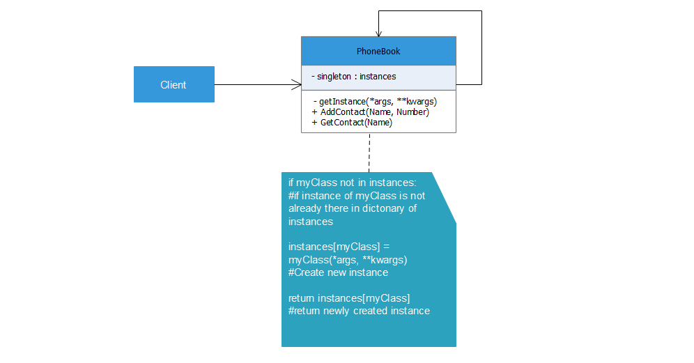

# Singleton

Singleton is a creational design pattern that lets you ensure that a class has only one instance, while providing a global access point to this instance.



## Python Example

In this example we created a dictonary named database which contains Name as a key while Number as value. We created the function signleton make sure the class PhoneBook has only and only one instance of class. We used decorator to bind the PhoneBook class as Singleton.
The AddContact() functions accepts two parameter Name and Number and adds the contact information in the database while the GetContact() function accepts just one argument Name and retreives the corresponding number from database dictonary.

## Running the example

We created two different objects of PhoneBook [singleton.py](singleton.py) (X and Y), we used X object to store the data in database while the Y object is used to retreive the data from database.
Here both the objects points to the same instance of class.

```
$python singleton.py

One new contact added to Phone Book
One new contact added to Phone Book
One new contact added to Phone Book
Contact Jayesh:  6124697466
Contact Nomaan:  5307176298
Contact Diksha:  5309335595
 
 ```