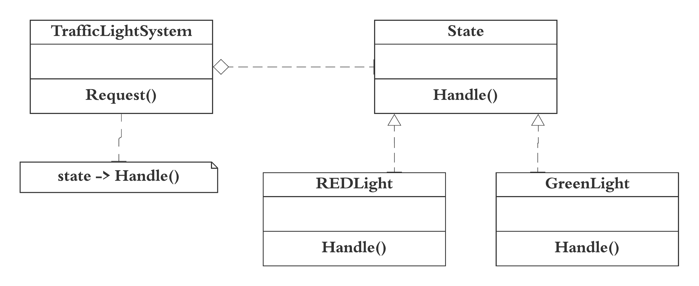

State design pattern is used when an Object changes its behavior based on its internal state. State pattern is used to provide a systematic and lose-coupled way to achieve this through Context and State implementations. 

For example, in a Traffic light system, after a timer change from RED to GREEN, GREEN to Yellow, and YELLOW to RED.  

The implemented code for State design pattern can be found [here](state.rb)   
