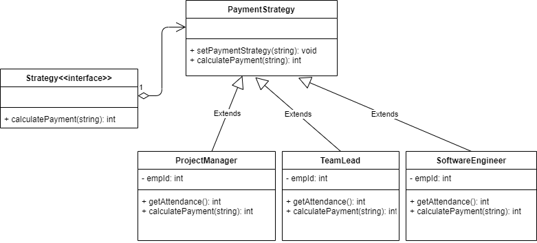

# Strategy pattern

## Definition
  Strategy pattern provides user to implement the algorithm at runtime.

## Implementation
1) The example displays PaymentStrategy class which consist of methods setPaymentStrategy() and calculatePayment() methods.
2) Three separate clases for TeamLead, ProjectManager, SoftwareEngineer are used to represent their payments via specific level strategy.
3) PaymentStrategy uses setPaymentStrategy() with argument of each class above
4) The calculatePayment() is called in implementation on PaymentStrategy instance as per levels of the position.
5) The payments are done as per the levels example 'class1', 'class2', 'intern' as per the position which internally could make use of the business logic.
6) Thus, specific payments with reference to each positions is done via Strategy pattern.
7) Use of Strategy class in UML could be done to modularize the common methods like calculatePayment() which represent aggregation in PaymentStrategy class.
(not used in this example).

## Links
[PaymentStrategy.js](./PaymentStrategy.js)
[ProjectManager.js](./ProjectManager.js)
[TeamLead.js](./TeamLead.js)
[SoftwareEngineer.js](./SoftwareEngineer.js)
[app.js](./app.js)

## UML Diagram:

## Advantages
1) It’s easy to switch between different algorithms (strategies) in runtime.
2) Code is much cleaner and avoids complex code.

