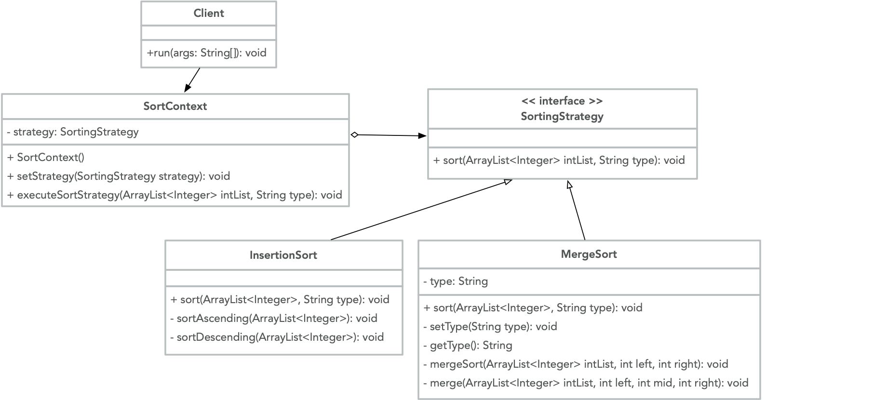

# Strategy

 Strategy is a behavioral design pattern that defines a family of algorithms. Strategy knows the essential features of each version of the algorithm, and allows them to be easily interchangeable. Often, there are many algorithms that can be used to implement a given task, and it would be useful to support more than one method. The Strategy pattern provides a straightforward way to encapsulate multiple subclass algorithms for the same task. The essential characteristics are clear from the interface, but the actual implementation details are kept separate, in derived classes.

 A practical use of the strategy design pattern is for a `SortingStrategy`. Different sorting algorithms are better suited for different cases. For instance, `InsertionSort` is faster when the size of the list being sorted is longer, and when the entries in the list are almost sorted. `MergeSort` is faster for longer lists, where the order of the list is not nearly sorted, or the order of the list is unknown. Here is a UML illustration of a `SortingStrategy` class:

 

## Java example

In this case, we create `SortingStrategy` as a common interface [SortingStrategy.java](SortingStrategy.java) for all supported sorting algorithms. The `SortContext` class [SortContext.java](SortContext.java) uses this interface to call the algorithm defined by a chosen concrete strategy. `SortContext` maintains a reference to a `SortStrategy` object and executes a sorting strategy based on input from the user. `InsertionSort` and `MergeSort` are the algorithms implemented through the `SortingStrategy` interface, in [InsertionSort.java](InsertionSort.java) and [MergeSort.java](MergeSort.java), respectively. Through [driver.java](driver.java) and `SortContext`, a user can input their choice to sort in ascending or descending order, using either insertion sort or merge sort, and the chosen `SortingStrategy` will be executed accordingly.

## Running the example
After compiling all of the classes using `javac`, any sorting strategy can be chosen via user input through the `driver`. The user chooses whether to sort in ascending or descending order, and using either insertion sort or merge sort, and the `SortContext` takes care of executing the requested strategy.

```{bash}
$ javac SortingStrategy.java MergeSort.java InsertionSort.java
$ javac SortContext.java driver.java
$ java driver
Original intList: [5, 3, 1, 2, 4]
Enter 1 (sort in ascending order) or 2 (sort in descending order)
1
Enter 1 (insertion sort) or 2 (merge sort)
2
Sorted List: [1, 2, 3, 4, 5]
$ java driver
Original intList: [5, 3, 1, 2, 4]
Enter 1 (sort in ascending order) or 2 (sort in descending order)
2
Enter 1 (insertion sort) or 2 (merge sort)
1
Sorted List: [5, 4, 3, 2, 1]
```
