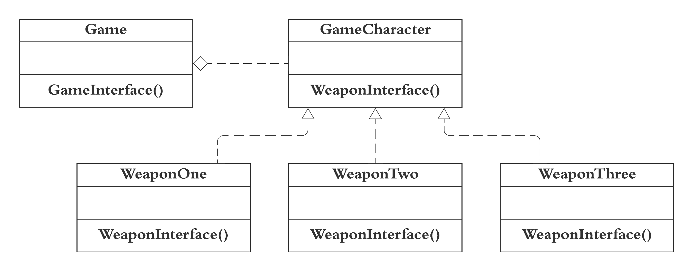

Strategy pattern helps to define a family of algorithms, to encapsulate each one of them and make them interchangeable and independent from the clients that use them. With this approach, our system become much more flexible and even the algorithm may be changed at runtime. The idea is to use encapsulated family of algorithms as composition within the client’s class instead of inheritance. 

For example, In a game where we can have different characters and each character can have multiple weapons to attack, but at a time can use only one weapon. The method will have different implementation depends on which weapon is being used.  

The implemented code for Strategy design pattern can be found [here](strategy.rb)   
