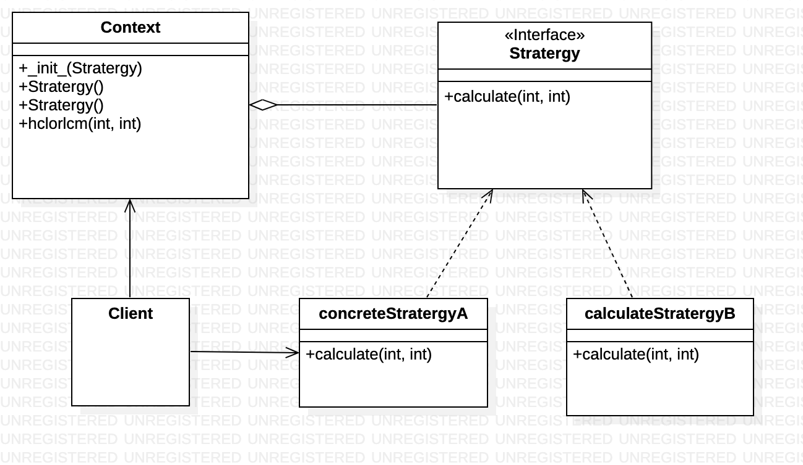

# Stratergy

The strategy method is Behavioral Design pattern that allows you to define the complete family of algorithms, encapsulates each one and putting each of them into separate classes and also allows to interchange there objects. It is implemented in Python by dynamically replacing the content of a method defined inside a class with the contents of functions defined outside of the class. It enables selecting the algorithm at run-time.




# Python example
In this case, we can create the `Stratergy` class ([stratergy.py](stratergy.py)),


1. The Context maintains a reference to one of the concrete strategies and communicates with this object only via the strategy interface.
2. The Strategy interface is common to all concrete strategies. It declares a method the context uses to execute a strategy.
3. Concrete Strategies implement different variations of an algorithm the context uses. 
4. The Context calls the execution method on the linked strategy object each time it needs to run the algorithm. The context doesn’t know what type of strategy it works with or how the algorithm is executed.
5. The Client creates a specific strategy object and passes it to the context. The context exposes a setter which lets clients replace the strategy associated with the context at runtime.
6. This process gives out the HCF and LCM of the given numbers.

# Output of the program

```
Client: Strategy is set to calculate lcm of 2 numbers: 
Context: Calculating LCM or HCF using the stratergy (not sure how it'll do it)
LCM it is!
Result:  1700

Client: Strategy is set to calculate hcf of 2 numbers: 
Context: Calculating LCM or HCF using the stratergy (not sure how it'll do it)
HCF it is!
Result:  1
```