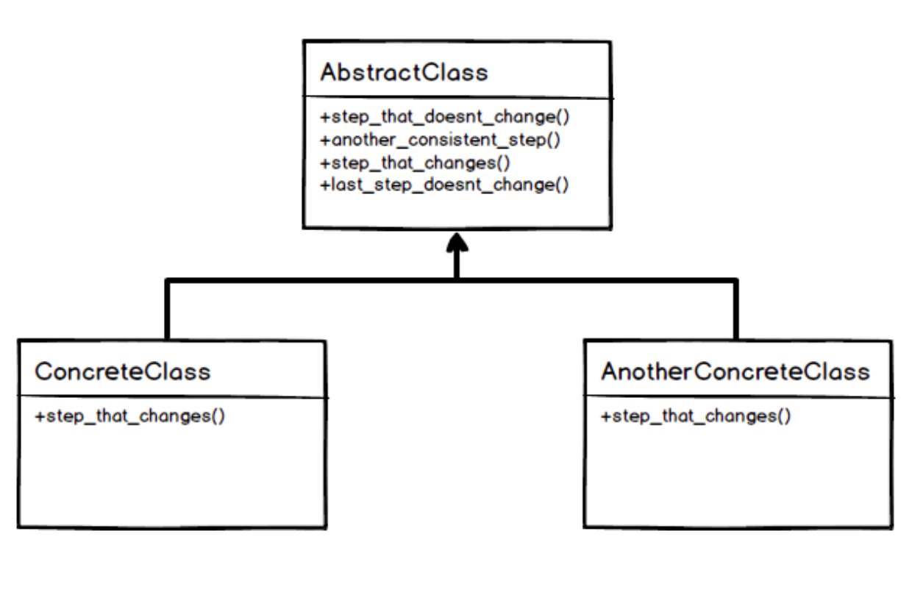
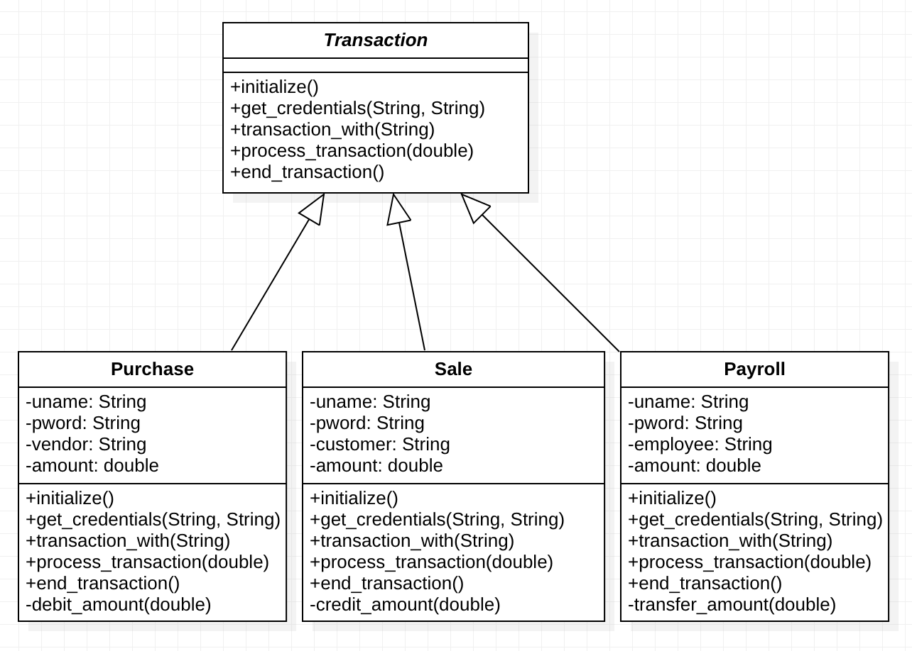

# Template Method Design Pattern
Template method defines the steps to execute an algorithm and it can provide default implementation that might be common for all or some of the subclasses.
Suppose we want to provide an algorithm to build a house. The steps need to be performed to build a house are – building foundation, building pillars, building walls and windows. The important point is that the we can’t change the order of execution because we can’t build windows before building the foundation. So in this case we can create a template method that will use different methods to build the house.

Now building the foundation for a house is same for all type of houses, whether its a wooden house or a glass house. So we can provide base implementation for this, if subclasses want to override this method, they can but mostly it’s common for all the types of houses.

To make sure that subclasses don’t override the template method, we should make it final.

# Design Pattern UML

This pattern is useful anytime you have an algorithm that has one or more steps that need to vary, or when you have a couple algorithms that are very nearly the same but differ by just a step or two.
Rather than having multiple classes that implement a nearly identical set of instructions, or trying to mash up methods that are really different responsibilities into one class, you can cleanly seperate concerns into their own implementations.

# Java Example
In the example we have a Basic ERP System which creates a transaction for Purchase, Sale and Payroll.
- [Purchase.java](example/Purchase.java) is a Concrete class which implements the Transaction class.
- [Sale.java](example/Sale.java) is a Concrete class which implements the Transaction class.
- [Payroll.java](example/Payroll.java) is a Concrete class which implements the Transaction class.
- [ERP_System.java](example/ERP_System.java) is the Client which runs the ERP System.

In this example, every Transaction has fixed steps and remain same for Purchase, Sale, and Payroll.
Each of the concrete class has a private function which calculates the transaction amount.

# Example UML

# Use of Design Pattern
- The template method is used in frameworks, where each implements the invariant parts of a domain's architecture, while providing hook methods for customization. This is an example of inversion of control. The template method is used for the following reasons.
- It lets subclasses implement varying behavior (through overriding of the hook methods).
- It avoids duplication in the code: the general workflow of the algorithm is implemented once in the abstract class's template method, and necessary variations are implemented in the subclasses.
- It controls the point(s) at which specialization is permitted. If the subclasses were to simply override the template method, they could make radical and arbitrary changes to the workflow. In contrast, by overriding only the hook methods, only certain specific details of the workflow can be changed, and the overall workflow is left intact.