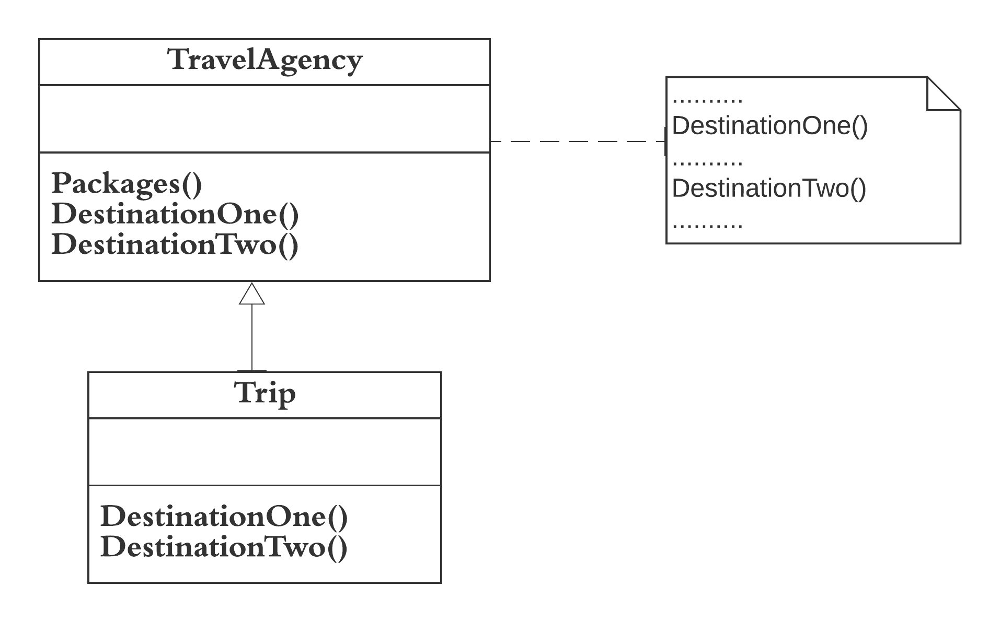

The implementation of Template Method discussed in the Travel Agency example demonstrates the Template Method pattern. 

* Template Method is a behavioral design pattern that defines the skeleton of an algorithm in the superclass but lets subclasses override specific steps of the algorithm without changing its structure. 

* Template method is used as an inverted control structure, sometimes referred as “the Hollywood principle”: from the superclass point of view: “Don't call us, we'll call you”. 

For instance, The travel agency is managing each trip. All the trips contain common behavior but there are several packages. For example each trip contains the basic steps: 1.The tourists are transported to the holiday location by plane/train/ships. 2.Each day they are visiting some place. 3.They are returning back home.
  
The implemented code for Template Method can be found [here](templatemethod.rb)

