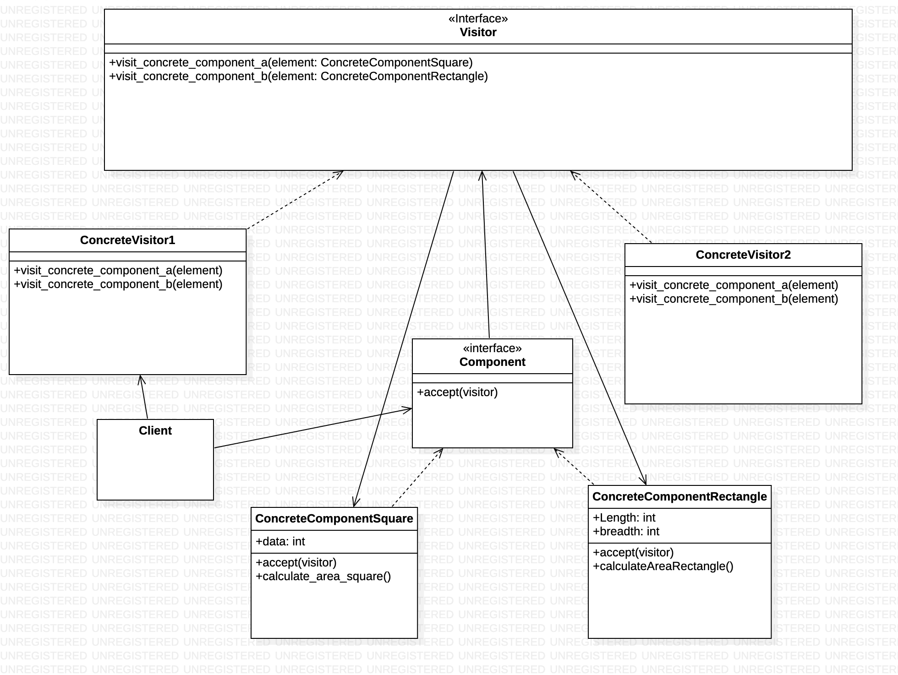

# Visitor

Visitor Method is a Behavioral Design Pattern which allows us to separate the algorithm from an object structure on which it operates. It helps us to add new features to an existing class hierarchy dynamically without changing it. All the behavioral patterns proved as the best methods to handle the communication between the objects. Similarly, it is used when we have to perform an operation on a group of similar kinds of objects.




# Python example

Visitor Method is a Behavioral Design Pattern which allows us to separate the algorithm from an object structure on which it operates. It helps us to add new features to an existing class hierarchy dynamically without changing it. All the behavioral patterns proved as the best methods to handle the communication between the objects. Similarly, it is used when we have to perform an operation on a group of similar kinds of objects.


# Output of the program

```
The client code works with all visitors via the base Visitor interface:
Area of square:  25
It allows the same client code to work with different types of visitors:
Area of rectangle is : 140
```