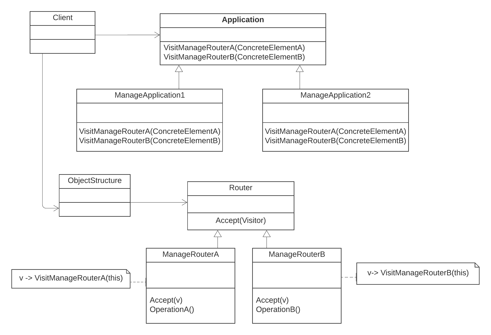

The implementation of Visitor pattern discussed in the Router Management example demonstrates the Visitor pattern. 
* The visitor design pattern is a way of separating an operation from an object structure on which it operates.  
* This pattern allows one to add new virtual functions to a family of classes without modifying the classes themselves.  
* With the help of visitor pattern, we can move the operational logic from the objects to another class.  

Suppose we have an application which manages routers in different environments. Routers should be capable of sending and receiving char data from other nodes and applications should be capable of configuring routers in different environments.  

Essentially, design should be flexible enough to support the changes in way that routers can be configured for additional environments in future, without much modifications in source code.     
The implemented code for builder can be found [here](visitor.rb)

